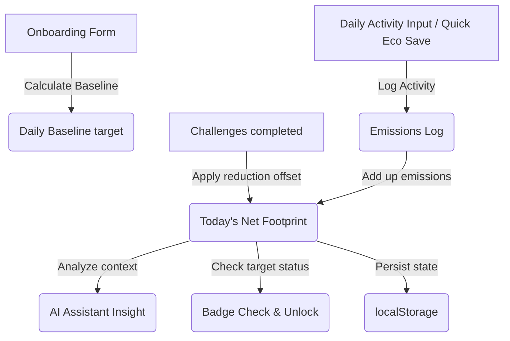

# 🌿 EcoTrace Carbon Tracker

EcoTrace is a lightweight, responsive, and aesthetically stunning **Personal Carbon Footprint Tracking and Reduction Assistant**. It is designed to run completely on the client side (under 10 MB total size) while offering premium glassmorphic UI, rich interactive components, and gamified challenges to make reducing greenhouse gas emissions rewarding.

---

## 🌟 Chosen Vertical
**Sustainability / Personal Carbon Tracker & Reduction Assistant**

In an era where personal actions aggregate to global trends, EcoTrace aims to democratize carbon awareness by giving individuals a tangible dashboard to measure daily behaviors, visualize emission sinks, and simulate smart eco-coaching.

---

## 🏗️ Approach & Architecture Logic

The application follows a modular, vanilla-oriented frontend architecture:
1. **Core Structure (`index.html`):** Uses semantic HTML5, CDN-based Tailwind CSS for styles, and FontAwesome for icons, keeping the file footprint extremely small (no bulky node modules inside the repository).
2. **Core Calculator (`js/calculator.js`):** Encapsulates calculation formulas and emission coefficients. Runs in both Node.js (for testing) and browser contexts (via standard Universal Module Definition compatibility).
3. **Challenges & Gamification (`js/challenges.js`):** Manages interactive weekly objectives, track points, and updates badge unlocks dynamically.
4. **Smart AI Assistant (`js/ai-assistant.js`):** Evaluates user emission statistics contextually to produce real-time critiques, eco-insights, and customized query responses.
5. **App Orchestration (`js/app.js`):** Bridges the data layers, routes DOM events, and maintains persistence across browser reloads using `localStorage`.

### Data Mapping Flow:


---

## 🚀 How It Works

1. **Onboarding Setup:** On first load, the user is presented with a slide-by-slide onboarding wizard collecting Diet Type, Primary Transit Mode, Household size, and Country. This initializes their daily baseline emissions (target ceiling).
2. **Carbon Dashboard:** Shows user's net emissions, carbon savings, baseline target, and allowance usage metrics in real-time.
3. **Logging System:** 
   - **Manual Logging:** Log specific transport mileage, meal types, utility numbers, and purchases.
   - **Quick Eco Saves:** One-click shortcuts (like choosing a plant-based meal or using a reusable mug) that apply immediate negative carbon offsets and award bonus points.
4. **Reduction Roadmap (Weekly Challenges):** Gamified challenges that can be marked complete, deducting carbon from net emissions and boosting score points.
5. **Simulated AI Assistant:** A persistent interactive sidebar chat interface. Type queries (e.g., "how can I reduce transport emissions?" or "summarize my day") to get specific coaching and dashboard diagnostic reports.
6. **Achievements/Badges:** Automatically unlocks achievements (e.g., "Eco Seedling", "Carbon Clipper", "Transit Champ") when specific milestones are crossed.

---

## 📊 Emission Coefficients & Assumptions

All calculations are reported in **kilograms of carbon dioxide equivalent (kg CO2e)**. The metrics are modeled on standard empirical findings from environmental datasets (such as the EPA, Greenhouse Gas Protocol, and Our World in Data):

### 1. Onboarding Daily Baseline (kg CO2e/day)
The baseline represents average daily emissions derived from annual averages divided by 365, categorized by lifestyle factors:

| Category | Input Option | Emission Coefficient | Assumption Details |
| :--- | :--- | :--- | :--- |
| **Diet** | Vegan | 1.5 kg CO2e / day | Plant-based ingredients, low transport packaging. |
| | Vegetarian | 2.5 kg CO2e / day | Inclusion of eggs, milk, cheese. |
| | Flexitarian | 3.8 kg CO2e / day | Meat meals limited to 1-3 times a week. |
| | Average Carnivore | 5.8 kg CO2e / day | Regular meat, poultry, fish consumption. |
| **Transit** | Walking / Biking | 0.0 kg CO2e / day | Pure muscle power. |
| (Assumes 20km daily) | Public Transit | 0.8 kg CO2e / day | ~0.04 kg CO2e per passenger km (bus/train). |
| | Electric Vehicle | 1.0 kg CO2e / day | ~0.05 kg CO2e per km including grid charging. |
| | Petrol / Diesel Car | 4.0 kg CO2e / day | ~0.20 kg CO2e per km for average internal combustion. |
| **Housing** | Studio / Flat | 2.0 kg CO2e / day | Shared heating/cooling walls, low electrical footprint. |
| | Medium House | 4.5 kg CO2e / day | Standard single family energy grid draw. |
| | Large House | 7.0 kg CO2e / day | Substantial HVAC loads and room counts. |
| **Grid Factor** | USA | Multiplier: 1.2 | Higher coal/gas generation mix. |
| | EU | Multiplier: 0.9 | High penetration of wind/nuclear/renewables. |
| | India | Multiplier: 1.1 | Significant coal utility mix. |
| | Other / Average | Multiplier: 1.0 | Standard global benchmark grid. |

### 2. Logged Activity Factors
For custom entries, emissions are calculated by multiplying input quantities by category-specific factors:
- **Transport:**
  - Petrol/Diesel car: `0.20 kg CO2e` per km driven.
  - Bus/Train: `0.04 kg CO2e` per km traveled.
  - Carpooling: `0.10 kg CO2e` per km (sharing driver emissions).
- **Food:**
  - Meat meal: `2.0 kg CO2e` per meal (reflecting carbon-heavy beef/pork).
  - Vegetarian meal: `0.8 kg CO2e` per meal.
  - Vegan meal: `0.4 kg CO2e` per meal.
- **Energy:**
  - Grid Electricity: `0.45 kg CO2e` per kWh.
  - Heating/Cooling: `1.5 kg CO2e` per hour of active climate control.
- **Consumption:**
  - Purchase: `5.0 kg CO2e` per new item bought (embodies textiles/manufacture footprint).

### 3. Quick Action Savings (Offsets)
- **Plant-Based Meal:** saves `1.2 kg CO2e` (swapping meat meal for vegetarian meal).
- **Public Transit Swap:** saves `1.6 kg CO2e` (swapping 10 km drive with bus).
- **Unplug Devices:** saves `0.5 kg CO2e` (avoiding grid standby draw).
- **Reusable Bag/Mug:** saves `0.2 kg CO2e` (avoiding single-use paper/plastics).

---

## 🧪 Testing and Quality Assurance

A quick Node.js unit testing suite is provided under the `tests` directory. The test runs assertions on both edge-case onboarding and activity emissions.

### Running the tests:
Ensure Node.js is installed locally on your system, then execute:
```bash
node tests/test-calculator.js
```
The output confirms baseline multipliers, negative input restrictions, and quick save calculations operate within 100% precision.
